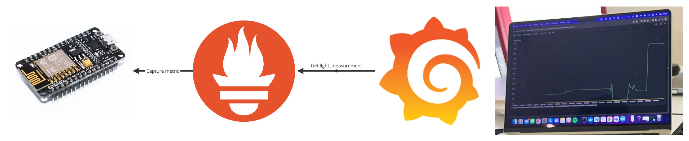

# Maersk Innovation Challenge (Lumin Alert)
This is an innovation project put forth by Maersk. Maersk is a shipping container company who contribute to transporting 80% of the worlds goods.
With shipping being the cheapest and most used method for transporting goods across the atlantic, it is unfortuantely also a huge target for ilegal smugling.
There are many things being smugled in containers, but one of the most impactful things is cocaine. This innovation project concludes with a functional prototype that detects tamperings using lights.
This project used the double diamond and the innovative mindset as the foundational design process.

__Demonstration below__

## What, Why, Where, Who, When, How?

**What**: Maersk has experienced with their containers being tampered with in order to transport contraband undetected. The usual contraband is cocaine.

**Why**: Smugling cocaine is a big problem worldwide, and identifying more ilegal activities will have a positive impact overall.

**Where**: Helping Maersk and potentially the whole maritime industry will have a marginal effect everywhere in the world. It is estimated that about 80% of all goods are at some point transported in shipping containers.

**Who**: Maersk is the main stakeholder who has an interest in solving the problem, but it is also of great interest to customs, clients of Maersk and also the goverment.

**When**: As long as cocaine is smugled in shipping containers, a tighter security is needed. An implementation that would modify/change containers or modify processes across the world will take time, but can be effective as long as smugling occurs. 

**How**: Improving visibility and tightining the access of the content in containers can help detect tamperings and thus reduce smugling of cocaine in containers.

## Solution

A set of photon light sensors are installed inside the container, which measures the amount of lights entering the container. Utilizing the light measurements can infer the physical access to the contents of the container. An electronic lock is used to provide authentication to disallow all unauthorized openings. Cross referencing the light sensor mesaurements with the logs of the lock, can detect unauthorized access to the content of the container.

## Prototype

An [espressif ESP8266 chip](https://www.espressif.com/en/products/socs/esp8266) with built in WiFi is used to capture an analog signal from a light sensitive resistor. The ESP8266 is programmed to work as a http server, which can then capture and serve the analog signal from the light resistor. See [iot.ino](./iot.ino) for the chip program. See also [mock.go](./mock.go) as a mock for providing measurements without a running ESP8266.

[Prometheus](https://prometheus.io/docs/prometheus/latest/), an open source time series database is then used to request the sensor readings on a regular interval. [Grafana](https://grafana.com/), an open source dashboarding platform is then used to query, visualize and alert with prometheus as datasource.  See [startup.sh](./startup.sh) for grafana and prometheus setup.

https://github.com/DanielHauge/maersk-lumin-alert/assets/9106182/accb7db9-d4dc-49e0-af27-3580f9b4be76

